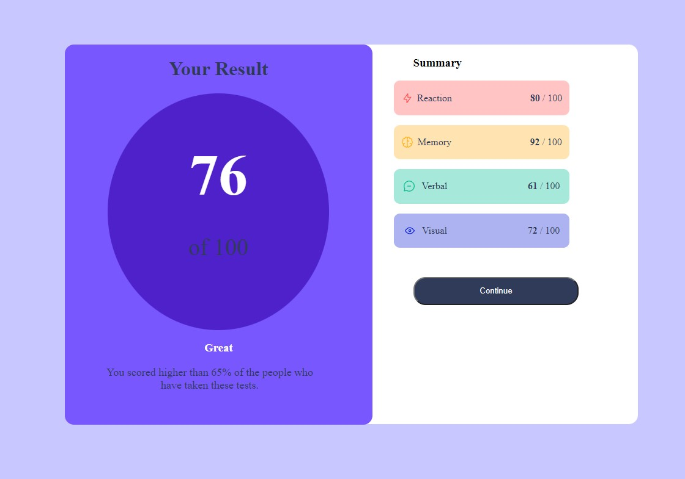

# Frontend Mentor - Results summary component solution

This is a solution to the [Results summary component challenge on Frontend Mentor](https://www.frontendmentor.io/challenges/results-summary-component-CE_K6s0maV). Frontend Mentor challenges help you improve your coding skills by building realistic projects. 

## Table of contents

- [Overview](#overview)
  - [The challenge](#the-challenge)
  - [Screenshot](#screenshot)
  - [Links](#links)
  - [Built with](#built-with)
  - [What I learned](#what-i-learned)
  - [Author](#author)
  - [Acknowledgments](#acknowledgments)

## Overview

### The challenge

Users should be able to:

- View the optimal layout for the interface depending on their device's screen size
- See hover and focus states for all interactive elements on the page

### Screenshot

### Links

- Solution URL: [Solution Github Repo](https://github.com/shaunpour/results-summary-component)
- Live Site URL: [Live Site via Github Pages](https://shaunpour.github.io/results-summary-component/)

## My process

### Built with

- Semantic HTML5 markup
- CSS custom properties
- Flexbox
- Mobile-first workflow

### What I learned

This project I can't point to anything particular that it taught me. This was done more as a learning exercise to improve my CSS design skills. I'm not the best when it comes to css and making websites look decent so I wanted to practice some more and that is where this project came in.

## Author

- Website - [Shaun Pour](https://darkphoenixninja92.github.io/)
- Frontend Mentor - [@DarkPhoenixNinja92](https://www.frontendmentor.io/profile/DarkPhoenixNinja92)
- Twitter - [@Dark_Ninja92](https://twitter.com/Dark_Ninja92)
- GitHub - [@ShaunPour](https://github.com/ShaunPour)

## Acknowledgments

Big thanks to Jessica Chan aka Coder Coder on Youtube for her videos inspiring me to keep at it with my web development journey. I consistently come back to your videos encouraging me to keep learning even when it seems like my efforts aren't getting me anywhere. You are a true inspiration and if not for your video encouragement, I might've given up on coding a long while ago just due to how I tend to be overly critical of myself so thank you very much!
